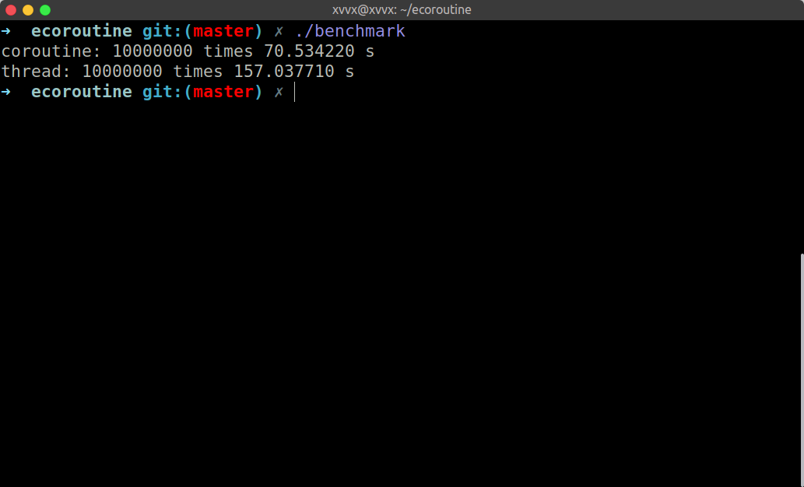

## ecoroutine

A simple stackful asymmetric scheduling coroutine library for modern C++.

### How to use?

#### create a coroutine
```C++
ecoroutine::CoroutineFunc func = [i](){};
coroutine_t c = ecoroutine::create(func);
```
Notice: this `create` is different from the `pthread_create`, since the coroutine will
not begin to work immediatly. You need to call `ecoroutine::start`.


#### start a coroutine
```C++
ecoroutine::start(c);
```

#### yield a coroutine
```C++
ecoroutine::yield();
```
`yield` will yield the current running coroutine. If you try to yield the main coroutine,
it'll report an error. Because coroutine is non-preemptive, the only way to give up control of CPU is
yield. And the current coroutine's state will change to HangUp, and the scheduler will begin
to work.

#### benchmark
与C++11中std::thread相比，ecoroutine不需要陷入内核态进行切换，性能有稳定50%以上优势。

测试为创建20万次thread/coroutine的时间消耗，结果如下：



测试代码：

```C++
constexpr uint32_t loop_times = 100000;

uint64_t coroutine_test() {
    ecoroutine::CoroutineFunc func = [](){ ecoroutine::yield(); };
    clock_t start = clock();
    for (int i = 0; i < loop_times; ++i) {
        ecoroutine::coroutine_t coroutine1 = ecoroutine::create(func);
        ecoroutine::coroutine_t coroutine2 = ecoroutine::create(func);
        ecoroutine::run(coroutine1);
        ecoroutine::run(coroutine2);
        ecoroutine::run(coroutine1);
        ecoroutine::run(coroutine2);
    }
    clock_t end = clock();

    return end - start;
}

uint64_t thread_test() {
    auto func = [](){};
    clock_t start = clock();
    for (int i = 0; i < loop_times; ++i) {
        std::thread thread1(func);
        std::thread thread2(func);
        thread1.join();
        thread2.join();
    }
    clock_t end = clock();

    return end - start;
}

int main(int argc, char* argv[]) {
    const int kMicrosecondsPerSecond = 1000 * 1000;
    printf("coroutine: %d times %f s\n", loop_times * 2,
           static_cast<double>(coroutine_test()) / kMicrosecondsPerSecond);
    printf("thread: %d times %f s\n", loop_times * 2,
           static_cast<double>(thread_test()) / kMicrosecondsPerSecond);
    return 0;
}

```

#### example

```C++
int main() {
    vector<ecoroutine::coroutine_t> coroutines;
    for (int i = 0; i < 10; ++i) {
        ecoroutine::CoroutineFunc func = [i](){
            for (int j = 0; j < 3; ++j) {
                cout << "[coroutine_t " << ecoroutine::self() << "] before yield:" << j << endl;
                ecoroutine::yield();
                cout << "[coroutine_t " << ecoroutine::self() << "] after yiled: " << j << endl;
            }
        };
        coroutines.push_back(ecoroutine::create(func));
    }

    for (auto x : coroutines) {
        ecoroutine::start(x);
    }
    return 0;
}
```

result:
```
[coroutine_t 1] before yield:0
[coroutine_t 2] before yield:0
[coroutine_t 3] before yield:0
[coroutine_t 4] before yield:0
[coroutine_t 5] before yield:0
[coroutine_t 6] before yield:0
[coroutine_t 7] before yield:0
[coroutine_t 8] before yield:0
[coroutine_t 9] before yield:0
[coroutine_t 10] before yield:0
[coroutine_t 1] after yiled: 0
[coroutine_t 1] before yield:1
[coroutine_t 2] after yiled: 0
[coroutine_t 2] before yield:1
[coroutine_t 3] after yiled: 0
[coroutine_t 3] before yield:1
[coroutine_t 4] after yiled: 0
[coroutine_t 4] before yield:1
[coroutine_t 5] after yiled: 0
[coroutine_t 5] before yield:1
[coroutine_t 6] after yiled: 0
[coroutine_t 6] before yield:1
[coroutine_t 7] after yiled: 0
[coroutine_t 7] before yield:1
[coroutine_t 8] after yiled: 0
[coroutine_t 8] before yield:1
[coroutine_t 9] after yiled: 0
[coroutine_t 9] before yield:1
[coroutine_t 10] after yiled: 0
[coroutine_t 10] before yield:1
[coroutine_t 1] after yiled: 1
[coroutine_t 1] before yield:2
[coroutine_t 2] after yiled: 1
[coroutine_t 2] before yield:2
[coroutine_t 3] after yiled: 1
[coroutine_t 3] before yield:2
[coroutine_t 4] after yiled: 1
[coroutine_t 4] before yield:2
[coroutine_t 5] after yiled: 1
[coroutine_t 5] before yield:2
[coroutine_t 6] after yiled: 1
[coroutine_t 6] before yield:2
[coroutine_t 7] after yiled: 1
[coroutine_t 7] before yield:2
[coroutine_t 8] after yiled: 1
[coroutine_t 8] before yield:2
[coroutine_t 9] after yiled: 1
[coroutine_t 9] before yield:2
[coroutine_t 10] after yiled: 1
[coroutine_t 10] before yield:2
[coroutine_t 1] after yiled: 2
[coroutine_t 2] after yiled: 2
[coroutine_t 3] after yiled: 2
[coroutine_t 4] after yiled: 2
[coroutine_t 5] after yiled: 2
[coroutine_t 6] after yiled: 2
[coroutine_t 7] after yiled: 2
[coroutine_t 8] after yiled: 2
[coroutine_t 9] after yiled: 2
[coroutine_t 10] after yiled: 2
```
